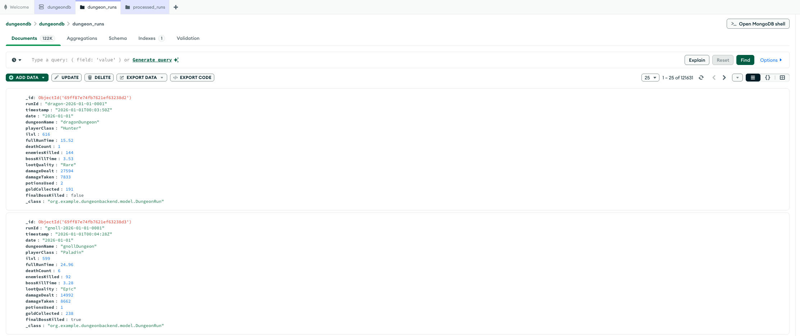
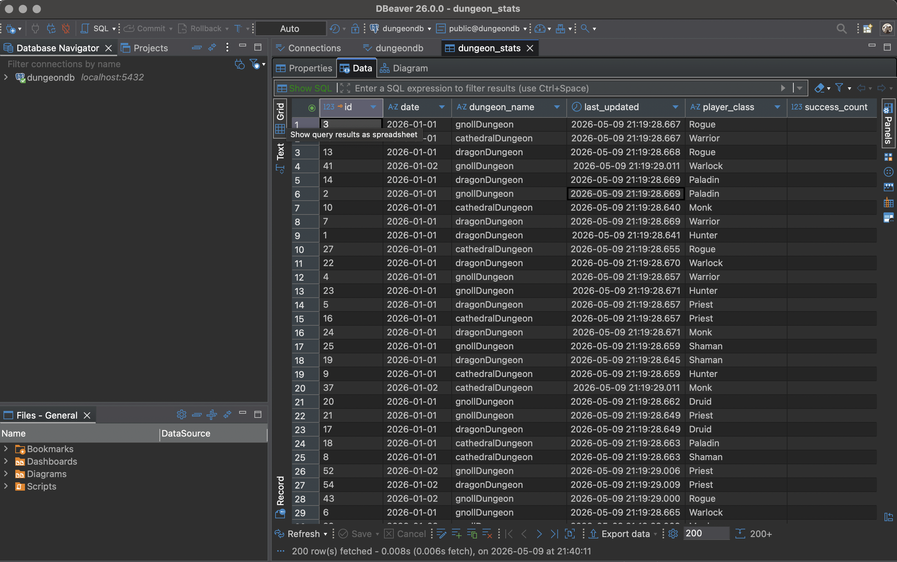
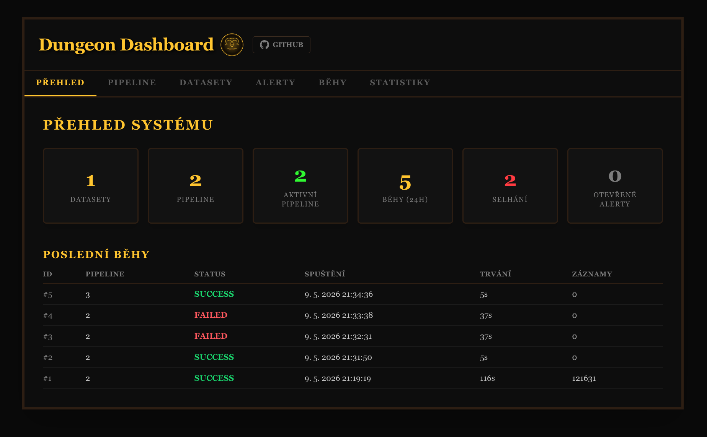
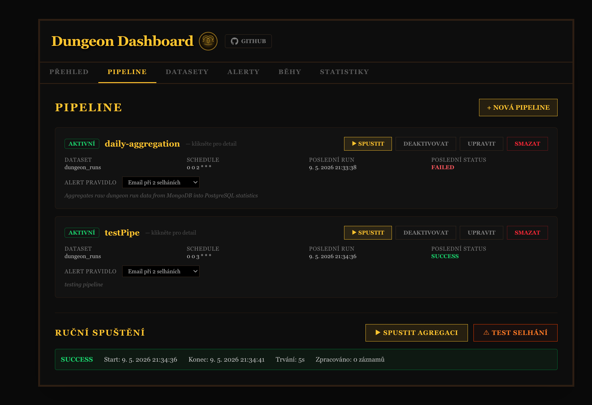
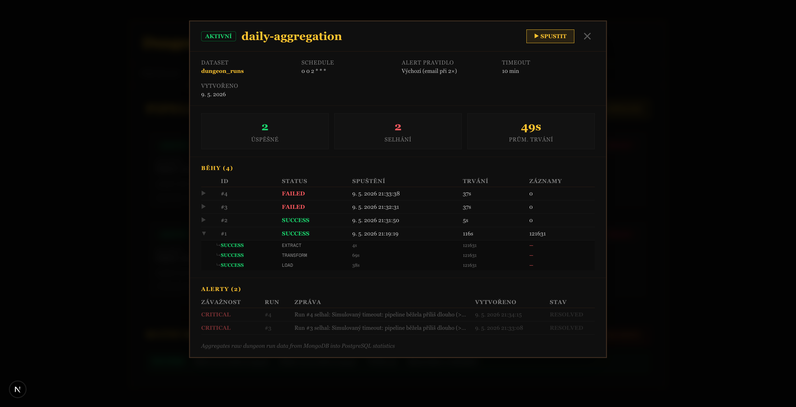
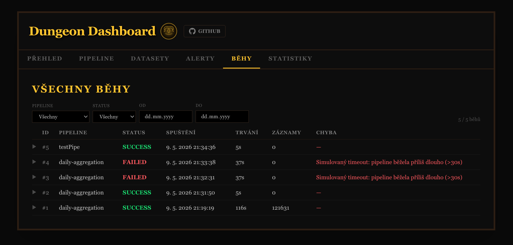

# Dungeon Dashboard – Big Data Pipeline Monitor

Projekt MSWA. Simulace orchestrace a monitoringu datových pipeline na téma fantasy dungeon runů z World of Warcraft.

---

## Struktura projektu

```
.
├── dungeonBackend/          # Spring Boot backend (Java)
├── dungeon-frontend/        # Next.js frontend (TypeScript)
├── postgresdb/              # Lokální PostgreSQL server (Postgres.app)
├── simulateRuns.py          # Generátor syntetických dat
├── *DungeonEndInput.json    # Ukázkové vstupy pro ruční testování API
└── dungeonStatistics.json   # Ukázkový export statistik
```

---

## Backend

Spring Boot aplikace běžící na `http://localhost:8080`. Při startu `DataSeeder` automaticky vytvoří výchozí dataset `dungeon_runs` v PostgreSQL a odpovídající kolekci v MongoDB, pokud ještě neexistují.

### Datový tok

Každý příchozí dungeon run se přijme přes `POST /api/dungeon/run` a uloží jako dokument do MongoDB kolekce odpovídající datasetu. Název datasetu v PostgreSQL přímo odpovídá názvu kolekce v MongoDB — pipeline pak čte z té kolekce, na kterou dataset odkazuje.

```
simulateRuns.py  →  POST /api/dungeon/run  →  MongoDB (raw)
                                                    ↓
                                             Pipeline (ETL)
                                                    ↓
                                          PostgreSQL (statistiky)
```

### ETL Pipeline

Každý běh pipeline prochází třemi fázemi, sledovanými jako samostatné `JobRunStep` záznamy v PostgreSQL:

**EXTRACT** — načte všechny dokumenty z příslušné MongoDB kolekce do paměti (`mongoTemplate.findAll`). Zaznamená počet načtených dokumentů.

**TRANSFORM** — projde každý načtený run a aktualizuje agregovaný řádek v tabulce `dungeon_stats` (klíčovaný kombinací `dungeonName + playerClass + date`). Pokud řádek pro danou kombinaci ještě neexistuje, vytvoří ho. Inkrementálně připočítává `totalRuns`, `totalTime`, `totalDeaths`, `totalItemLevel` a `successCount`.

**LOAD** — pro každý zpracovaný run vytvoří kopii v MongoDB kolekci `processed_runs` (auditní stopa) a původní dokument z produkční kolekce smaže. Tím je zajištěno, že příští spuštění pipeline nezpracuje stejná data znovu.

Průběh každé fáze (status, čas zahájení/ukončení, počet zpracovaných záznamů, případná chybová zpráva) je viditelný v záložce **Běhy → detail jobu**.

Agregace probíhá automaticky každý den ve **2:00** (cron `0 0 2 * * *`). Pipeline má retry logiku — při selhání se po 30 s pokusí znovu.

### Alerting

Chování při selhání řídí konfigurovatelné **alert rule** přiřazené každé pipeline:

| Režim | Chování |
|---|---|
| `CONSECUTIVE_FAIL_EMAIL` | E-mail po dvou po sobě jdoucích selháních |
| `NO_ALERTS` | Žádné alerty ani e-maily |
| `EXCLUDE_TIMEOUT_FAILURES` | Alerty pouze při reálných chybách, timeouty ignorovány |

### Databáze

| Databáze | Port | Obsah |
|---|---|---|
| MongoDB | 27017 | Raw dungeon runy (per dataset kolekce), processed runy |
| PostgreSQL | 5432 | Statistiky, pipeline, datasety, job runy, alert rules, alerty |




### Schéma PostgreSQL

Tabulky jsou spravovány Hibernatem (`ddl-auto=update`) a generovány automaticky při prvním startu backendu.

**`datasets`**

| Sloupec | Typ | Popis |
|---|---|---|
| `id` | BIGINT (PK) | Automaticky generované ID |
| `name` | VARCHAR (NOT NULL) | Název datasetu — odpovídá názvu MongoDB kolekce |
| `description` | VARCHAR | Volitelný popis |
| `owner` | VARCHAR (NOT NULL) | Vlastník datasetu |
| `schema_version` | VARCHAR | Volitelná verze schématu |
| `created_at` | TIMESTAMP | Čas vytvoření záznamu |

**`pipelines`**

| Sloupec | Typ | Popis |
|---|---|---|
| `id` | BIGINT (PK) | Automaticky generované ID |
| `name` | VARCHAR (NOT NULL) | Název pipeline |
| `description` | VARCHAR | Volitelný popis |
| `dataset_id` | BIGINT (NOT NULL) | Odkaz na `datasets.id` |
| `schedule` | VARCHAR | Cron výraz (výchozí `0 0 2 * * *`) |
| `active` | BOOLEAN (NOT NULL) | Zda pipeline aktuálně běží na cronu |
| `timeout_minutes` | INTEGER (NOT NULL) | Maximální povolená délka běhu (výchozí 10) |
| `created_at` | TIMESTAMP | Čas vytvoření záznamu |

**`job_runs`**

| Sloupec | Typ | Popis |
|---|---|---|
| `id` | BIGINT (PK) | Automaticky generované ID |
| `pipeline_id` | BIGINT | Odkaz na `pipelines.id` |
| `status` | VARCHAR | `PENDING` / `RUNNING` / `SUCCESS` / `FAILED` |
| `started_at` | TIMESTAMP | Čas spuštění běhu |
| `finished_at` | TIMESTAMP | Čas ukončení (NULL pokud stále běží) |
| `duration_seconds` | BIGINT | Délka běhu v sekundách |
| `records_processed` | INTEGER | Počet zpracovaných záznamů |
| `error_message` | VARCHAR(1000) | Chybová zpráva při selhání |

**`job_run_steps`**

| Sloupec | Typ | Popis |
|---|---|---|
| `id` | BIGINT (PK) | Automaticky generované ID |
| `job_run_id` | BIGINT | Odkaz na `job_runs.id` |
| `step_name` | VARCHAR (NOT NULL) | Název fáze: `EXTRACT`, `TRANSFORM`, nebo `LOAD` |
| `status` | VARCHAR (NOT NULL) | `PENDING` / `RUNNING` / `SUCCESS` / `FAILED` |
| `started_at` | TIMESTAMP | Čas zahájení fáze |
| `finished_at` | TIMESTAMP | Čas ukončení fáze |
| `records_processed` | INTEGER | Počet záznamů zpracovaných v dané fázi |
| `error_message` | VARCHAR(1000) | Chybová zpráva při selhání fáze |

**`alert_rules`**

| Sloupec | Typ | Popis |
|---|---|---|
| `id` | BIGINT (PK) | Automaticky generované ID |
| `pipeline_id` | BIGINT (NOT NULL, UNIQUE) | Odkaz na `pipelines.id` — jedno pravidlo na pipeline |
| `alert_mode` | VARCHAR (NOT NULL) | `CONSECUTIVE_FAIL_EMAIL` / `NO_ALERTS` / `EXCLUDE_TIMEOUT_FAILURES` |

**`alert_events`**

| Sloupec | Typ | Popis |
|---|---|---|
| `id` | BIGINT (PK) | Automaticky generované ID |
| `pipeline_id` | BIGINT | Odkaz na `pipelines.id` |
| `job_run_id` | BIGINT | Odkaz na `job_runs.id` |
| `message` | VARCHAR (NOT NULL) | Text alertu |
| `severity` | VARCHAR | `INFO` / `WARNING` / `CRITICAL` |
| `status` | VARCHAR | `OPEN` / `RESOLVED` |
| `created_at` | TIMESTAMP | Čas vzniku alertu |

**`dungeon_stats`**

| Sloupec | Typ | Popis |
|---|---|---|
| `id` | BIGINT (PK) | Automaticky generované ID |
| `dungeon_name` | VARCHAR | Název dungeonu (např. `gnollDungeon`) |
| `player_class` | VARCHAR | Třída postavy (např. `Paladin`) |
| `date` | VARCHAR | Datum ve formátu `YYYY-MM-DD` — klíč agregace |
| `total_runs` | BIGINT | Celkový počet runů pro tuto kombinaci |
| `total_time` | DOUBLE PRECISION | Součet časů všech runů (minuty) |
| `total_deaths` | BIGINT | Součet smrtí napříč všemi runy |
| `total_item_level` | BIGINT | Součet item levelů (pro výpočet průměru) |
| `success_count` | BIGINT | Počet runů, kde byl zabit finální boss |
| `last_updated` | TIMESTAMP | Čas poslední aktualizace řádku pipeline |

---

## Frontend

Next.js aplikace dostupná na `http://localhost:3000`.

| Záložka | Co umí |
|---|---|
| Přehled | Souhrnné metriky: počty datasetů, pipeline, běhů, alertů |
| Pipeline | Seznam pipeline – spuštění, aktivace/deaktivace, nastavení alert rules, detail s historií běhů |
| Datasety | Správa datasetů (CRUD) |
| Alerty | Přehled alert eventů, možnost vyřešit (resolve) |
| Běhy | Kompletní historie job runů s filtry (pipeline, status, datum) |
| Statistiky | Zpracovaná data z PostgreSQL – weekly/monthly/yearly přehledy per dungeon a per třída |

Mimo cron job lze pipeline spustit ručně tlačítkem **Spustit** na záložce Pipeline. Dashboard se při běžícím jobu aktualizuje každé 3 sekundy.







---

## Generování dat

Skript `simulateRuns.py` generuje syntetická data dungeon runů a posílá je přes REST API na backend.

Každý run obsahuje: dungeon, třídu postavy, item level, čas běhu, počet smrtí, damage, loot atd.

**Charakteristika datasetu:**

Simulované období: `2026-01-01` → `2026-04-15` (105 dní celkem).

- **3 dungeony** s různými rozsahy obtížnosti: `gnollDungeon`, `dragonDungeon`, `cathedralDungeon`
- **9 tříd postav**, každá s vlastním profilem (rychlost, damage, tendence k smrtím)
- **Postupný růst item levelu** o +13 bodů napříč celým obdobím
- **Víkendový provoz** 1 500–2 000 runů/den, všední dny 600–1 300

**Balance patche** — periodické změny silové hierarchie tříd viditelné v datech:

| Patch | Datum | Hlavní změny |
|---|---|---|
| Patch 1.1 | 2026-01-22 | Warrior a Monk posíleni, Rogue a Priest oslabeni |
| Patch 1.2 | 2026-02-12 | Warrior oslaben, Monk / Hunter / Warlock / Paladin posíleni |
| Patch 1.2.1 | 2026-02-19 | Hotfix: Monk nerfnut, Druid a Shaman konečně posíleni, Rogue částečně obnoven |
| Patch 1.3 | 2026-03-05 | Priest a Warrior redemption arc, Rogue dokončen, meta se stabilizuje |
| Season 2 | 2026-03-20 | Nová sezona: výrazné navýšení obtížnosti, win rate všech tříd klesá o 22–35 %, death count roste o 2–4 na run |

Prvních 3 dní po každém patchi mají všechny třídy zvýšený počet smrtí — hráči si zvykají na změněné mechaniky.

---

## Spuštění

### Požadavky
- Java 21+
- Node.js 18+
- Python 3.9+
- MongoDB běžící na `localhost:27017`
- PostgreSQL běžící na `localhost:5432` (uživatel/heslo `postgres/postgres`)

### Inicializace databází

**PostgreSQL** — databázi je nutné vytvořit jednou ručně:
```sql
CREATE DATABASE dungeondb;
```
Tabulky (`pipelines`, `job_runs`, `alert_rules`, atd.) Hibernate vytvoří automaticky při prvním startu backendu (`spring.jpa.hibernate.ddl-auto=update`). Výchozí dataset a pipeline se také vytvoří automaticky přes `DataSeeder`.

**MongoDB** — žádná příprava není potřeba. Databáze `dungeondb` vznikne automaticky při prvním zápisu. Kolekce pro jednotlivé datasety vytváří backend sám při startu nebo při vytvoření nového datasetu z frontendu.

### Backend
```bash
cd dungeonBackend
./mvnw spring-boot:run
```
Běží na `http://localhost:8080`.

### Frontend
```bash
cd dungeon-frontend
npm install
npm run dev
```
Běží na `http://localhost:3000`.

### Generování dat
```bash
python3 simulateRuns.py
```
Skript pošle tisíce dungeon runů do backendu. Poté je lze zpracovat spuštěním pipeline z frontendu.
